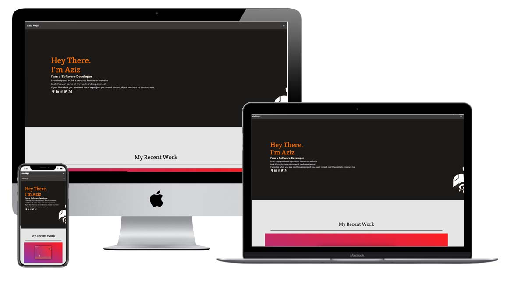

# Curriculum Cr Training Contact Form

> In this project, I am creating the form with formspree service. The website is web responsive and mobile and desktop friendly.

## Screenshot

## Built With

- HTML and CSS
- Linters and Hint

## Getting Started

To get a local copy up and running follow these simple example steps.
On your terminal type: git clone git@github.com:aboongm/curriculum-cr-training-contact-form
.git

## Author

👤 **Ranjit Luwang**

- GitHub: [@aboongm](https://github.com/aboongm)
- Twitter: [@John_luang1](https://twitter.com/John_luang1)
- LinkedIn: [LinkedIn](https://www.linkedin.com/in/aboongm)

👤

## 🤝 Contributing

Contributions, issues, and feature requests are welcome!

Feel free to check the [issues page](../../issues/).

## Show your support

Give a ⭐️ if you like this project!

## Acknowledgments

- Thanks to Microverse for the template of this!

## 📝 License

This project is [MIT](./MIT.md) licensed.